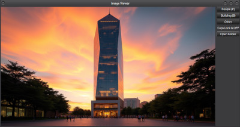

# ImageSegregator: Segregate Images



This program, written in C++ with GTK+, is a tool for organizing images into folders based on predefined categories. It displays images from a folder and allows users to sort them into target directories by clicking dynamically created buttons or using keyboard shortcuts.

## Features
- **Dynamic Buttons**: Buttons are created based on a JSON configuration file to move images into specified folders.
- **Keyboard Shortcuts**: Assign keys to categories for quicker image sorting.
- **Image Preview**: Displays the current image and scales it to fit within the viewer.
- **Caps Lock Indicator**: A live label shows the state of the Caps Lock key.
- **Folder Selection**: Easily choose a folder containing images to organize.

---

## Sample JSON Configuration

Create a file named `imageSegregator.json` in the folder you wish to organize. Here’s an example:

```json
[
    {
        "value": "Landscapes (key: l)",
        "path": "/path/to/landscapes",
        "key": "l"
    },
    {
        "value": "Portraits (key: p)",
        "path": "/path/to/portraits",
        "key": "p"
    },
    {
        "value": "Other with no key",
        "path": "/path/to/miscellaneous",
    }
]
```

- **`value`**: The label for the button.
- **`path`**: The target directory where images will be moved.
- **`key`**: (Optional) A single character to use as a keyboard shortcut for this category.

---

## Setup and Usage

### 1. Install Dependencies
Install the required libraries:
```bash
sudo apt update
sudo apt install libgtk-3-dev nlohmann-json3-dev
```

### 2. Compile the Program or install
Compile using `g++` and script from this repo:
```bash
./GCompileAndPack.sh
```

Install deb:
```bash
sudo dpkg -i ImageSegregator.deb
```

### 3. Prepare the JSON Configuration
Place the `imageSegregator.json` file in the folder containing the images to be organized. Ensure the paths in the JSON file exist, or the program will create them automatically.

### 4. Run installed 
Execute the program:
```bash
ImageSegregator
```

### 5. Select Folder
- Click **"Open Folder"** to select a directory containing your images and the JSON configuration file.
- The program will load the images and dynamically create buttons based on the JSON data.

### 6. Sort Images
- Use **buttons** to move images to their corresponding categories.
- Press the **assigned key** (if configured) to move the current image to a category.

### 7. Caps Lock State
The **Caps Lock label** updates every 500ms to indicate whether Caps Lock is enabled.

---

## Notes
- **Supported Formats**: `.jpg`, `.jpeg`, `.png`, `.bmp`
- **Scaling**: Images are resized to a maximum height of 600 pixels for display.
- **Keyboard Shortcuts**: Case-sensitive, so ensure Caps Lock is in the desired state.
- **Error Handling**: Errors like missing files or failed moves will show a dialog box.

---

## Links

My tools for images segregation, resizing etc:

*  - GTKmm, find duplicated images in subfolders
*  - Console, find duplicated images in subfolders
*  - GTK, usefull tool for images segregation
*  - GTK , resize images in folder
*  - Qt, resize images in folder

---

